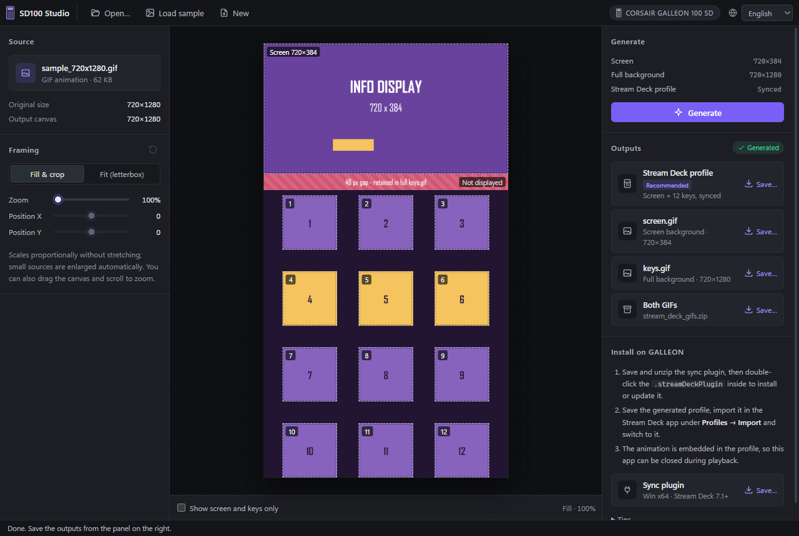

<div align="center">


# SD100 Studio

**One animation. Screen and keys. One timeline.**<br />
An offline Windows tool that turns any GIF or WebM into a synchronized animated background<br />
for the CORSAIR GALLEON 100 SD, exported as a ready-to-import Stream Deck profile.

[](CHANGELOG.md)
[](#get-started)
[](#install-on-the-galleon)
[](https://www.electronjs.org/)
[](LICENSE)

[Get started](#get-started) · [Features](#features) · [Shortcuts](#keyboard-shortcuts) · [Changelog](CHANGELOG.md) · [Report an issue](https://github.com/maddoxhuang/galleon-100-sd-studio/issues)

</div>

---



## Features

- **Any GIF or WebM**: any size and any length, with no file size limit. WebM (VP8 or VP9) is converted to GIF at 10, 15, 20, 25 or 30 fps.
- **Live 720×1280 preview** of the whole device face, with drag, scroll-to-zoom and keyboard framing. Choose *Fill & crop* or *Fit (letterbox)*, and optionally black out everything the hardware does not show.
- **One-click Stream Deck profile**: the screen and all 12 keys play on one shared timeline, with native dial navigation and a second page that keeps every key free.
- **Plain GIFs too**: `screen.gif` (720×384) and `keys.gif` (the full 720×1280 canvas), individually or as a ZIP.
- **Sync plugin and sample animation included**, so nothing has to be downloaded separately.
- **Fully offline**: everything is processed on your computer, and the app makes no network requests.
- **English and Simplified Chinese** interface.

## Why a plugin?

> [!NOTE]
> The Stream Deck app currently has a bug with the GALLEON 100 SD: when an animated GIF is used as a background, the keys do not animate. They stay on a still image.

To work around this, SD100 Studio comes with a small sync plugin, listed in Stream Deck as **GALLEON Screen Player**. The generated profile embeds the whole animation, and the plugin plays it: it decodes each frame and sends the screen and key images straight to the device, so the screen and all 12 keys move together on one timeline. This is why you install the plugin once in addition to importing the profile.

The plain `screen.gif` and `keys.gif` files are exported as well, but because of this bug they cannot give you animated keys when you set them directly as backgrounds in the Stream Deck app.

## Get started

1. Download `galleon-100-sd-studio-<version>-windows-x64.exe` from [Releases](https://github.com/maddoxhuang/galleon-100-sd-studio/releases/latest). It is a portable single file; there is nothing to install.
2. Run it. The EXE is not code-signed, so Windows SmartScreen may warn you the first time; choose **More info → Run anyway**.
3. Open a GIF or WebM, adjust the framing, click **Generate** and save the profile.
4. [Install the sync plugin and import the profile](#install-on-the-galleon).

Requirements: Windows 10 or 11 (x64) and the Stream Deck app 7.1 or later. The interface starts in English; switch to Simplified Chinese from the language menu (🌐) at the right end of the toolbar. The choice is remembered.

### Workflow

1. **Open a source**: click **Open…**, press Ctrl+O or drop a GIF or WebM anywhere in the window. **Load sample** opens the bundled 720×1280 sample.
2. **Frame it**: the canvas plays a live 720×1280 preview.
   - Drag to move the image and scroll to zoom.
   - In the left panel, choose **Fill & crop** or **Fit (letterbox)**, or set zoom and position precisely with the sliders.
   - **Show screen and keys only** blacks out everything outside the screen and keys. The mask only affects the preview, never the export.
3. **WebM only: choose a frame rate**. Set **Output frame rate** to 10, 15, 20, 25 or 30 fps (default 20). When you click **Generate**, the whole clip is converted without audio; a progress bar is shown, and **Cancel** or Esc stops the conversion.
4. **Generate**: click **Generate**. The outputs are listed below it, and each **Save…** opens the Windows save dialog. Cancelling a save keeps the result, so you can save it again. If you change the framing or the WebM frame rate afterwards, the list shows **Settings changed** until you generate again. Opening a new source clears the previous outputs.

## Keyboard shortcuts

| Shortcut | Action |
|----------|--------|
| Ctrl+O | Open a GIF or WebM |
| Ctrl+N | New: clear the current source and outputs |
| Esc | Cancel a running WebM conversion |

With the canvas focused:

| Key | Action |
|-----|--------|
| Arrow keys | Move the image by 8 px (40 px with Shift) |
| `+` / `-` | Zoom in or out |
| `0` | Reset the zoom to 100% |

## Install on the GALLEON

1. In the right panel, save **Sync plugin** (`GALLEON_Screen_Player_v2_0_2.zip`) and extract it. Double-click `com.sd100.screen-player.streamDeckPlugin` inside to install or update the plugin. The ZIP also contains a `README.txt` with these instructions.
2. In the Stream Deck app, import the generated profile under **Profiles → Import** and switch to it.
3. The animation is embedded in the profile, so SD100 Studio can be closed during playback. The Stream Deck app must keep running.

## Outputs

Every frame is composited first, then scaled onto the **720×1280** master canvas with the same crop settings. GIFs keep their original frame delays. WebM is sampled at the chosen frame rate, and the total duration is kept to within the 10 ms resolution of GIF timing.

| File | Contents |
|------|----------|
| `GALLEON_100_SD_Background.streamDeckProfile` | Recommended. Screen and 12 keys animated in sync, native dial page navigation and a Functions page |
| `screen.gif` | The 720×384 screen, from (0, 0) on the master canvas |
| `keys.gif` | The full 720×1280 master canvas: the screen, the 48 px hidden band below it and all key gaps. It is not a compact 480×640 grid |
| `stream_deck_gifs.zip` | `screen.gif` and `keys.gif` |

The twelve 160×160 key GIFs (`key_01` to `key_12`, numbered left to right, top to bottom) are embedded in the profile and are not exported separately.

Key positions on the master canvas:

| Keys | X | Y | Size |
|------|---|---|------|
| 1–3 | 56, 280, 504 | 448 | 160×160 |
| 4–6 | 56, 280, 504 | 672 | 160×160 |
| 7–9 | 56, 280, 504 | 896 | 160×160 |
| 10–12 | 56, 280, 504 | 1120 | 160×160 |

The drawable hardware sizes (720×384 for the screen, 160×160 per key) follow the [galdeck HID implementation](https://docs.rs/galdeck/latest/galdeck/). The master canvas and the positions above are this tool's own export layout.

## Profile and sync plugin

The profile has two pages:

- **Animation page**: all 12 keys use the plugin's **GALLEON Synchronized Background** action. Pressing them does nothing.
- **Functions page**: all 12 keys are free for your own actions.

Names follow the interface language when you click **Generate**. In English, the profile and its animation page are both named `GALLEON 100 SD Background` and the second page `Functions`; with the Chinese interface they get Simplified Chinese names.

On both pages the left dial uses the native Stream Deck **Action Trigger**: turn counterclockwise for the previous page or clockwise for the next page, and press it to return to the animation page (`PageIndex: 0`). No key is used for navigation. When you add pages, copy the left-dial action to them. This Action Trigger setup (Previous Page, Go to Page and Next Page, in that order) is copied from the GALLEON default profile that ships with Stream Deck 7.4; see Elgato's [Action Trigger guide](https://help.elgato.com/hc/en-us/articles/29655069662609-Elgato-Stream-Deck-Action-Trigger).

How playback works:

- The top-left main key embeds the full 720×1280 GIF, so playback does not depend on the original file.
- One decoder and one clock render the 720×384 screen JPEG and twelve 160×160 key JPEGs from the same frame and send them over the GALLEON display HID interface. The whole 720×384 screen is drawn as one image.
- Images go over USB one after another, so a frame can take a moment to update everywhere, but the screen and keys never drift onto separate looping timelines.
- When a frame cannot be sent in time, it is skipped on the original timeline, so delays do not build up.
- Leaving the animation page stops writing and releases the device; returning starts playback again. To restart the animation from the first frame, select any of the 12 animated keys in the Stream Deck app and click **Restart synced playback** in its settings; the screen and all keys restart together.
- The plugin settings follow the Stream Deck app's language: Simplified Chinese for Chinese (Simplified or Traditional), English otherwise. Action names in the Stream Deck action list are localized only for Simplified Chinese; every other language, including Traditional Chinese, shows them in English.

Notes:

- On the animation page, keep the top-left main key (it stores the animation) and the left-dial navigation, and leave the rest of the screen empty. Full-screen rendering covers the dial's static icon, but the dial still works.
- If you replace one of the animated keys with another action, that key shows the new action and no longer plays the synchronized animation.
- The profile's device model is `GRETSCH`, verified against `Galleon100SD_winDefault.streamDeckProfile` from Stream Deck 7.4. Export never copies any of your existing profiles or actions.
- Profiles made with pre-release builds (plain GIF backgrounds, or four screen regions with plugin 1.x) keep playing the old way after you install this plugin; generate them again to get synchronized playback.
- Actual alignment and USB display latency have to be checked on a real device; the automated tests cannot measure them.

The plugin source is in `streamdeck-plugin/`. Stream Deck provides the Node.js 24 runtime, and the Windows x64 native dependencies (`node-hid`, `sharp`) are bundled in the `.streamDeckPlugin` package.

- The plugin only talks to Stream Deck over its local WebSocket, and only uses the display interface of a single connected GALLEON (VID 1B1C, PID 2B18, interface 0). Other models are rejected.
- It only writes screen and key JPEG reports (`02 0c` / `02 07`). It never sends brightness, reset, lighting or keyboard input reports. Key input and keep-alive stay with Stream Deck, which is why the Stream Deck app must keep running.
- It does not contact any server, read your files or modify existing profiles.

## Build from source

Requires Windows x64 and Node.js 24.

```powershell
npm ci
npm run desktop:build   # build the sync plugin and the desktop app
npm run desktop:start   # open the desktop window
npm run desktop:dist    # build the portable EXE into release/
```

`npm run plugin:build` validates and packs the plugin with Elgato's official CLI into `public/plugins/` (generated, not under version control). `npm run sample:galleon` regenerates the 720×1280 diagnostic sample, and `npm run icon:generate` regenerates the app icon `desktop/icon.ico` and the README logo `docs/logo.png`.

Tests:

- `npm test`: crop boundaries, animation timing, ZIP and profile contents, large GIF input, settings storage, and the plugin runtime (frame coordinates, shared clock, frame skipping, cancellation during writes, HID packets, local WebSocket, localization).
- `npm run test:desktop`: run `npm run desktop:build` first. Opens a real Electron window to check offline startup, GIF and WebM (VP8, VP9), drag and drop, the preview mask, cancel and retry, saving and cancelled saves, the minimum window layout, the Ctrl+O and Ctrl+N shortcuts, and language switching (interface, save dialog, profile page names and the setting after a restart).
- `npm run test:desktop:packaged`: the same checks against the packaged app. Run `npm run desktop:dist` or `npm run desktop:pack` first; the test runs the unpacked app in `build/release/win-unpacked`, which contains the same files as the portable EXE.

Desktop test output goes to `build/desktop-qa`. The tests never install the plugin or change your Stream Deck setup, and they do not replace checking playback on a real device. `npm run typecheck` and `npm run lint` are also available.

## Security and privacy

- The interface is served from the app's internal `sd100://` protocol; no local network port is opened.
- The renderer runs sandboxed with context isolation and no Node.js access, and all HTTP(S) requests are blocked.
- The app never opens external links or new windows. The only setting it writes is the interface language, in `%APPDATA%\SD100 Studio\settings.json`. That folder also holds Electron's cache; delete it to reset the app.
- Third-party license notices are generated at build time into `THIRD-PARTY-LICENSES.txt`, which is packed inside the app (`resources/app.asar`). The sync plugin's `.streamDeckPlugin` package contains its own copy.

## Credits and license

Based on [Stream Deck GIF Background Slicer](https://github.com/sebastiansperandio/Stream-Deck-BG) by **Sebastian Sperandio** (MIT). This project is also released under the MIT License; see [`LICENSE`](LICENSE).

CORSAIR, GALLEON, Elgato and Stream Deck are trademarks of their respective owners. This project is not affiliated with or endorsed by Corsair or Elgato.
